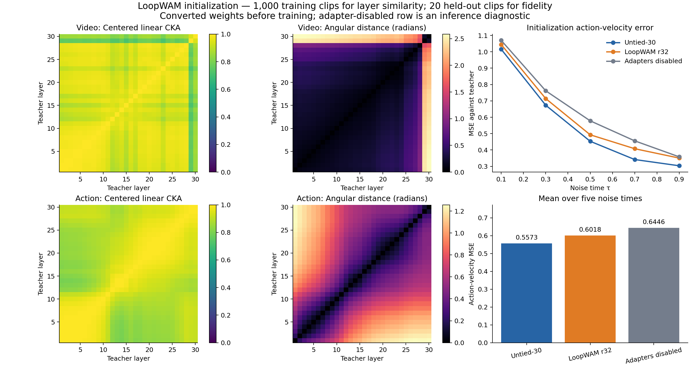
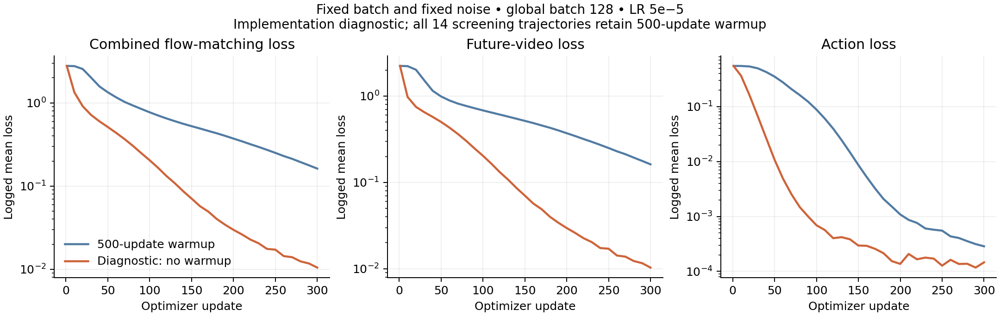
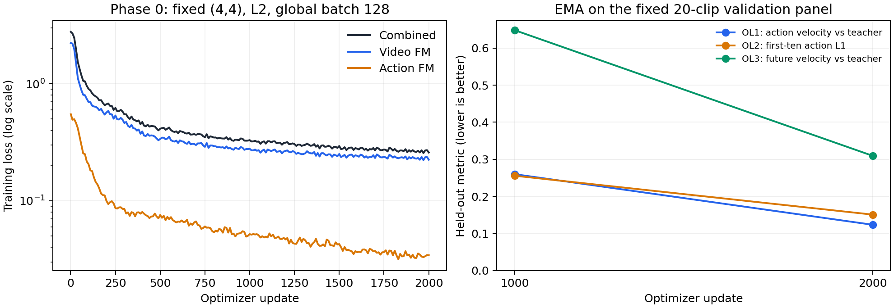

# LoopWAM v1: implementation and LIBERO-Long screening

Status (2026-10-05, 16:54 EDT): implementation on branch `LoopWAM_v1`; infrastructure validation passed and the LIBERO-Long campaign is running. P0-S completed 2,000 updates and its immediate 500-episode evaluation: **85/500 successes (17.0%)**. Teacher reproduction started automatically afterward. One of the fourteen training trajectories is complete; no best recipe has been selected. This report is updated as measured training and evaluation evidence becomes available.

For readers on GitHub, the [published result snapshot](results_snapshot/README.md) includes the comparison table, Phase-0 outcomes, timings, test evidence and forecast. Links to `outputs/` elsewhere in this report refer to the live cluster workspace.

## Scope and experimental contract

The implementation follows `plans/LoopWAM_v1.md` (v2 architecture) and the user's smaller initial route: P0-S; C1, C2, C3, S1-L2, S1-L3; S2-cont, S2-base; S3-coupled, S3-late, S3-Konly, S3-2stage; two end-to-end confirmation seeds. This is 14 training trajectories, with stage-dependent forks and gates. It excludes the initial video-KD, alternate-LR, r0, re-injection, deep-video-supervision and alternative-alignment ablations. LIBERO-10 is the training dataset and LIBERO-Long is the ten-task closed-loop evaluation suite.

The run budgets remain explicit optimizer-step endpoints. The 14 trajectories contain **142,000 incremental optimizer steps** at global batch 128 (18,176,000 sampled windows), excluding short infrastructure diagnostics. An interrupted trajectory resumes its optimizer state and does not count as another run. Gates can stop the route early; they do not automatically launch a fallback ablation.

| Phase | Run | Initialization or parent | Absolute optimizer steps | Incremental steps |
| --- | --- | --- | ---: | ---: |
| 0 | P0-S | Converted LoopWAM, L2 | 0–2,000 | 2,000 |
| 1 | C1 | Untied-30, L3 | 0–8,000 | 8,000 |
| 1 | C2 | Untied-12, L3 | 0–8,000 | 8,000 |
| 1 | C3 | Untied-V30/A12, L3 | 0–8,000 | 8,000 |
| 1 | S1-L2 | Converted LoopWAM, L2 | 0–8,000 | 8,000 |
| 1 | S1-L3 | Converted LoopWAM, L3 | 0–8,000 | 8,000 |
| 2 | S2-cont | Selected S1 checkpoint, fixed (4,4) | 8,000–14,000 | 6,000 |
| 2 | S2-base | Selected S1 checkpoint, coupled sampling | 8,000–14,000 | 6,000 |
| 3 | S3-coupled | S2-base, coupled sampling | 14,000–22,000 | 8,000 |
| 3 | S3-late | S2-base, decoupled sampling | 14,000–22,000 | 8,000 |
| 3 | S3-Konly | Selected S1 checkpoint, video budget fixed at 4 | 8,000–22,000 | 14,000 |
| 3 | S3-2stage | Selected S1 checkpoint, immediate decoupled sampling | 8,000–22,000 | 14,000 |
| 4 | F-Long-s1 | Converted initialization, selected schedule, seed 43 | 0–22,000 | 22,000 |
| 4 | F-Long-s2 | Converted initialization, selected schedule, seed 44 | 0–22,000 | 22,000 |

Screening training uses seed 42. Evaluation seeds are independently specified as 42 and 43. Confirmation runs follow the selected two-stage, action-only, coupled or three-stage schedule continuously from initialization. They do not inherit the screening optimizer state.

## Architecture and conversion

A separate `fastwam.loop` package preserves the original teacher execution as an independent numerical reference. The student uses the original Wan video/action preparation, positional encodings, velocity heads, schedulers and VAE. Video width is 2,048 with 16 × 128 attention heads and 8,192 FFN channels. Action width is 768, with 16 × 128 joint-attention heads, 6 × 128 text-attention heads and 3,072 FFN channels. The proprio encoder remains 8→4,096 because it creates a text-context token. The six action text-attention heads are selected from the teacher's **24** heads; this count is derived from the source tensors.

The looped model stores 3 prelude blocks, 6 core blocks and 3 coda blocks per stream: 12 unique blocks and `6 + 6K` effective layers. Core blocks have four explicit slots containing modulation deltas, copied norm parameters, bias deltas and rank-32 LoRA on every linear. A core linear uses `W + B_slot A_slot`, with no additional `alpha/r` multiplier, and `b + delta_b_slot`. Slots are function arguments rather than mutable module state, so activation-checkpoint recomputation cannot accidentally use the last slot executed during the forward pass. Each slot executes the original gated self-attention, cross-attention and gated FFN residuals once; the implementation adds no extra recurrent residual.

Video uses prefix loops 1…Kv. Action uses suffix slots Kv−Ka+1…Kv and reads the corresponding virtual video layers. First-frame keys/values retain autograd history in training. The full video pass supplies the final video FM loss and cached loop exits. A shorter video budget recomputes only its three coda blocks on first-frame tokens. This is numerically valid because the first frame never attends to future frames or actions. All ten budgets `1 ≤ Ka ≤ Kv ≤ 4` are supported.

Width conversion selects complete evenly spaced attention heads and FFN channels, then interpolates only action hidden axes with the original alpha-rescaling rule. Modulation/time-projection row groups are handled separately. Core weights are cycle-group means; biases/modulation/norms are restored by slot. Full-rank residual SVD is exact in numerical tests. Production rank 32 uses deterministic randomized SVD (oversampling 8, two power iterations); checkpoint metadata records this approximation and per-matrix captured residual energy.

The production LoopWAM artifact contains 1,079,946,183 parameters and occupies 2,160,261,923 bytes in bf16. This measured count includes video 891,250,880, action 188,658,439 and proprio 36,864 parameters. A serialization regression was found and fixed: the released proprio tensors are views into a 12,041,421,216-byte teacher storage, so conversion must clone them to avoid embedding the entire teacher storage in the compact checkpoint. A dedicated test checks this for both fp32 and bf16.

| Architecture | Video parameters | Action parameters | Total including proprio | bf16 artifact bytes |
| --- | ---: | ---: | ---: | ---: |
| LoopWAM r32 | 891,250,880 | 188,658,439 | 1,079,946,183 | 2,160,261,923 |
| C1 Untied-30 | 2,058,082,496 | 409,928,455 | 2,468,047,815 | 4,936,614,432 |
| C2 Untied-12 | 849,201,344 | 168,819,463 | 1,018,057,671 | 2,036,325,541 |
| C3 Untied-V30/A12 | 2,058,082,496 | 168,819,463 | 2,226,938,823 | 4,454,245,765 |

Counts come directly from canonical checkpoint tensor metadata and exclude the shared frozen VAE/text encoder. Untied-12 is approximately parameter-matched: LoopWAM's slots and adapters add 61.89 million parameters, about 6.08%, rather than giving exact equality. Source: `outputs/loopwam_v1/architecture_sizes.json`.

The initial rank-32 conversion captures less than 30% of the residual energy in 479 of 480 matrix/slot combinations. Weighted captured energy is 10.81% for video and 18.15% for action. This is a diagnostic warning for the recovery experiment, not evidence that the trained policy fails. Rank 64 is not automatically scheduled in the initial 14-run route.

### Measured initialization diagnostics

D1 completed on 1,000 deterministic, unpadded training clips. Mean centered linear CKA between layers in the six cycle groups is 0.9468 for video and 0.8998 for action; mean angular distances are 0.2881 and 0.6318 radians. These are similarities of token-mean teacher features, not proof that arbitrary layer replacement preserves behavior. D1 took 218.5 seconds after loading the model and dataset.

D2 used the same noisy inputs for every model over 20 held-out clips and five noise times. Initial action-velocity MSE against the teacher was 0.5573 for Untied-30, 0.6018 for LoopWAM r32, and 0.6446 with its adapters temporarily disabled. The adapter-disabled result is an initialization diagnostic; no r0 training ablation was added. Production full-rank adapters were not materialized; exact full-rank folding is covered by the numerical real-Wan tests. D2 took 52.1 seconds, including student loading.



Source artifacts: `outputs/loopwam_v1/initialization/{provenance,d1,d2}.json`. The corresponding PDF is `reports/figures/loopwam_initialization.pdf`.

### Implementation map

| File under `src/fastwam/loop/` | Responsibility |
| --- | --- |
| `convert.py` | Structured width conversion, untied controls, cycle means, residual SVD and canonical checkpoint metadata |
| `slots.py` | Shared linear/modulation parameters and explicit per-slot residuals/norms |
| `mot.py` | Virtual-layer schedules, differentiable first-frame caches, video exits and suffix-aligned action attention |
| `model.py` | Original FastWAM preparation/heads/schedulers, teacher bridge, multi-budget losses, inference and export |
| `losses.py` | Masked per-sample FM/KD reductions and sigma-shift guard |
| `data.py` | Immutable split, deterministic preprocessing, cached-record integrity and provenance |
| `sampler.py` | Rank-consistent budget sampling and resumable consumed-window ordering |
| `trainer.py` | DeepSpeed updates, LR, EMA, checkpoints, diagnostics and allocation-boundary handling |
| `runtime.py` | Durable per-invocation timing and aggregation across continuations |
| `diagnostics.py` | Fixed-panel OL1–OL3, loop dynamics, CKA and LoRA norm ratios |
| `evaluation.py` | LIBERO workers, episode evidence, strict summaries and latency measurement |
| `campaign.py` | The 14-run matrix, forks, scientific gates, evaluation dispatch and comparison tables |
| `reporting.py` | Standalone success-versus-latency PNG/PDF and their CSV/JSON source data |

The original FastWAM teacher files and the user's configuration edits remain separate from this implementation. The initial repository revision was `7faa711`; all implementation commits are on `LoopWAM_v1`.

## Data and losses

The dataset contains 388 demonstrations and 104,280 frame-start windows. A fixed task-stratified episode split reserves exactly two demonstrations per task: 368 training demonstrations/98,842 windows and 20 validation demonstrations/5,438 windows. Of these, 87,066 and 4,798 windows respectively are unpadded. The manifest records every original window ID, episode interval and metadata hash. All 388 parquet index/frame/episode/task columns were checked against the manifest. End padding retains original FastWAM semantics and is masked in the losses.

Preprocessing uses two 224×224 cameras concatenated horizontally, 33 observation steps subsampled to nine video frames, 32×7 actions and 8-dimensional proprioception. The loader decodes only the nine used video frames and bypasses upstream random-on-error fallback so a failed read cannot silently cross the validation split. Both student and teacher use the released normalization JSON. Stage 1 at 8,000 steps × 128 samples corresponds to 10.36 passes through the actual training-window count.

L2 is action FM plus future-video FM. L3 adds action-velocity KD. Teacher and student receive the exact same noisy video/action tensors and timestep tensors; each computes its own proprio context from the same normalized raw proprio. The teacher is frozen, in eval mode and under `no_grad`, with bf16 autocast. KD uses the same timestep weighting and padding reduction as action FM. Augmented samples receive zero KD contribution. All student/teacher train/inference sigma shifts must be 5.0; the existing action config's 1.0 is explicitly overridden in this workflow.

The elastic objective is `video_FM(4) + sum_b [action_FM(b) + action_KD(b)]` for L3, omitting KD for L2. The sum contains the full `(4,4)` budget and one deterministic, uniformly sampled additional budget per optimizer update. Coefficients are all one; the implementation does not silently average the two configurations or add a shallow video loss. All ranks and accumulation microbatches use the same sampled budget at a given absolute step. Teacher and full video computation are reused within the update.

Open-loop diagnostics use a documented fixed panel of one unpadded midpoint clip from each of the 20 held-out demonstrations, with saved window IDs and fixed noise. They compute OL1 against teacher action velocity at five fixed timesteps, OL2 first-ten action L1 after ten Euler steps and OL3 future-video velocity MSE. This panel is not an exhaustive evaluation of all 5,438 held-out windows. Closed-loop stage-end EMA evaluation remains the primary selection metric.

Additional diagnostics record global accumulated gradient norms before clipping, loop-state/update norms and cross-loop centered CKA at `(4,4), tau=0.5`, and each slot's `||BA||F / ||W||F`. The LoRA norm calculation uses rank-sized Gram matrices rather than materializing full residual matrices. Diagnostics preserve RNG and module modes, and the EMA context restores the exact original ZeRO parameter views.

### Frozen preprocessing cache

The dense-control probe exposed a sustained CPU bottleneck: its final two updates took 3.77–3.90 seconds, including 1.11–1.18 seconds waiting on the slowest loader rank. A shared cache of individual window encodings is now complete: **104,280 validated windows in 2,919.94 seconds** on four H100s, including overlap with the diagnostic-only overfit run. It retains normalized actions/proprioception, padding masks, window identity and deduplicated text contexts alongside frozen VAE outputs. Every scientific trajectory uses the same cache, with strict dataset, preprocessing, normalization and VAE provenance. Cache ID: `9e3e14e18e97edaa4f620177f8e54b2ee621d78c0a61c3cf9af83c1cadce27c4`.

A real H100 numerical check found batch-dependent bf16 encoder rounding: batch 16 versus batch 8 differed by 0.4084% relative L2 (maximum absolute difference 0.0625). Consequently, each cached window is encoded separately with a fixed batch size of one. This makes interrupted cache construction independent of batch membership. Singleton repeat, serialization/reload, noise and timestep draws, and first-frame causality were bit-identical in the checked padded and unpadded production clips. The cache preserves bf16 latents; converting them to fp32 would change noise generation. Cached training is not claimed to be bit-identical to the earlier batched-VAE throughput probes. Evidence: `outputs/loopwam_v1/cache_encoding_equivalence.json`.

Each record contains bf16 latents `[48,3,14,28]`, fp32 actions `[32,7]`, fp32 proprioception `[32,8]`, Boolean padding masks and original window/episode/task/frame IDs. The ten text contexts are stored once per task, retaining the original zero-padded embeddings and all-ones attention-mask behavior. Record checksums and a final complete marker prevent a partially written cache from being used for training. Offline construction can validate and refill missing or corrupt records; the training loader fails on corruption instead of silently falling back to a different preprocessing path. The manifest covers all 104,280 windows, including the held-out partition, and the loader enforces the original episode split.

## Optimization, resumption and evaluation

The standalone trainer uses global batch 128, AdamW beta (0.9,0.95), epsilon 1e-8, inherited LR 5e-5, 500-step linear warmup then constant LR, clipping 1.0, and EMA decay 0.999 updated once per optimizer update. Norms, biases, LoRA and slot deltas receive no weight decay. ZeRO-1/2 and microbatch/accumulation are configurable while preserving global batch and optimizer-step budgets. Native bf16 autocast keeps student/master parameters in fp32. The frozen teacher is deliberately outside the student's registered module tree, so it cannot enter the optimizer, EMA or training checkpoints.

Full-state checkpoints preserve raw weights, ZeRO optimizer shards, LR, EMA, absolute optimizer step, rank-specific RNG and the consumed-window cursor. The sampler's committed cursor is independent of dataloader prefetch. Forks preserve all training state and change the intended sampling mode and diagnostic budget list. A stop signal or time budget is handled at an optimizer boundary and checkpointed before exit. Final bf16 policy exports are distinct from resumable trainer states.

Each trainer invocation has a durable UUID record under `runtime/invocations/`, with its absolute step interval, allocation ID, wall time and separate initialization/training/checkpoint/diagnostic costs. `timing.json` remains the latest invocation snapshot. Aggregation counts actual work across continuations, reports replayed versus unique steps, weights warm throughput by measured steps, and keeps inherited parent costs out of fork-local runtime. Interrupted observations and legacy histories are labeled incomplete rather than treated as complete totals.

The campaign freezes content hashes for executable Python, launch scripts, LIBERO helpers and YAML configurations. Resume and child-process boundaries verify this identity. Changes between commands stop before launching the next job; changes during a child invocation mark its artifacts untrusted and block their reuse. Git commit is additional descriptive metadata, while documentation/report-only commits do not change the executable contract.

Closed-loop evaluation reuses FastWAM's LIBERO environment/action processing, with 50 fixed initial states per task, ten Euler steps, shift 5, replan every 10 actions, horizon 32 and maximum 700 steps. Persistent workers share tasks across available GPUs. Results retain per-episode paired outcomes, initial-state hashes, protocol/checkpoint provenance, Wilson intervals and measured wall time. Incomplete or failed tasks cannot become a completed 500-episode summary. Stage-end EMA checkpoints are evaluated immediately after each completed run. Comparisons in the 2–4 pp band require the prescribed second evaluation seed and paired McNemar test. The run table records pending/incomplete status explicitly.

After Stage-1 selection, one raw-versus-EMA evaluation uses the selected checkpoint at `(4,4)` and evaluation seed 42. It writes `eval_raw/` and never enters a selection gate. Phase 4 also schedules the plan's 12 delayed evaluations: three budgets `(4,4), (4,1), (1,1)` × two evaluation seeds × two confirmation training seeds. These write `eval_delay/` and a separate auxiliary comparison table.

Delayed evaluation models a **serial receding-horizon controller with zero-order command hold**. At each request, it freezes the observation and measures warmed observation preprocessing, compiled inference and action postprocessing. With measured latency `t` and the environment's actual control period `dt`, the new action chunk becomes available after `ceil(t/dt)` simulator ticks. During those ticks the simulator executes the exact previous processed command, with the original LIBERO dummy command used initially. It then executes the first ten new actions unchanged. Delay ticks count within the same 700-step cap; the original 30 settling steps remain outside it. Fifty warmup calls preserve RNG and do not advance the simulator. This discrete-event model does not implement buffered/asynchronous control, stale-action-prefix skipping, or latency compensation. Every request records its measured delay and quantization overhead.

## Verification evidence so far

- The final integrated CPU suite passed **153 tests in 78.21 seconds** at commit `acaeca8`, with zero failures, errors or skips. Tests cover actual Wan block restoration, full 30-layer velocity equality within 1e-3 fp32, tensor shapes/head maps, storage sharing, causal caches and action-output isolation, prefix exits, first-frame coda equality, all ten schedules, checkpointed gradients, identical KD inputs, per-sample masks, cache interruption/corruption, source integrity, delayed-controller behavior, accounting, launch gates and strict bf16 save/reload across every budget. Evidence: `outputs/loopwam_v1/pytest_final.xml` and `pytest_final.log`.
- Actual first/last training windows were decoded and checked for video/action/proprio/context shapes and end-padding behavior.
- A single teacher simulator episode (task 0/state 0) succeeded using the intended protocol. This verifies integration only; it is not a benchmark success-rate estimate.
- The real delayed-controller smoke check completed task 0/state 0 at the expected 0.05-second control period. It executed 118 held-command delay ticks and 582 new-policy ticks, exactly respecting the shared 700-step cap. The untrained converted policy did not solve the task; this is an integration pass, not a success-rate result. Evidence: `outputs/loopwam_v1/delay_smoke/result.json`.
- Four-H100 production L3 updates passed at microbatch 8/accumulation 4 and microbatch 16/accumulation 2. Both preserve global batch 128. Every trainable tensor received finite, nonzero gradients on every rank, including all shared weights, slot parameters, LoRA, norms and proprio parameters.
- A ten-step coupled-sampling probe completed without distributed hangs. Same-output resume advanced absolute step 10 to 11 with LR, optimizer, EMA and sample cursor restored. An explicit fork then advanced step 11 to 12 and changed sampling to fixed while preserving state. The actual EMA open-loop callback passed on 20 held-out windows and three budgets in 47.1 seconds. Untied-30 completed a separate five-update production probe.
- A subsequent cached, 20-update L3 coupled probe passed on four H100s. All four ranks had finite, nonzero gradients for every trainable tensor. Its actual EMA diagnostic at step 20 evaluated all ten budgets on the fixed 20-clip panel, produced finite OL1–OL3 values, captured all four loop exits in both streams, and recorded 480 finite LoRA norm ratios. The callback took 87.74 seconds, including the EMA wrapper and synchronization. Explicit budget lists ensure S2-cont logs its shallow exits and S3-Konly logs the required `(2,2)` retention diagnostic.
- A compile-cache defect was found before the campaign: PyTorch's default guard limit of eight could reject the ninth budget. The policy now scopes a sufficiently large Dynamo limit to its compiled inference call and restores the caller's setting even on an exception. A real-Wan CPU test runs all ten budgets through full-graph compilation, compares their eager outputs, and confirms that revisiting budgets creates no additional graphs. Production H100 `(4,4)` compilation was separately measured below.
- Independent review identified and corrected three issues: shallow OL3 must decode its own video exit; S3-Konly must satisfy the stated (2,2) retention constraint; same-output resume must reject a changed teacher or training recipe. The added Konly evaluation does not add a training trajectory.

### Controlled fixed-batch overfit diagnostic

The first 300-update L2 diagnostic used the standard 500-update warmup. Loss decreased from 2.78033 to 0.16219, but this was not accepted as near zero. Because the diagnostic ended before warmup completed, a follow-up changed only its warmup to zero; the nominal LR remained 5e-5. It reused the same initialization, first global batch of 128, fixed noise, seed, live VAE path, microbatch 16 and accumulation 2. The first forward losses matched exactly before any optimizer update.

Before starting that follow-up, its pass criterion was recorded: finite losses/gradients; mean combined loss over updates 271–300 no more than 1% of the initial loss; and each FM term no more than 0.03. It **passed** with mean combined loss 0.0115441 (0.4152% of initial), video 0.0114105 and action 0.000133641. The final logged interval had combined loss 0.0104683. This establishes that the implementation can memorize the fixed input/noise batch; it does not measure closed-loop generalization. The screening schedule remains unchanged at 500 warmup updates.

The baseline training portion took 517.27 seconds; the follow-up took 890.96 seconds while sharing GPUs with cache construction. The latter is explicitly excluded from throughput comparisons. Both peaked at 56.19 GB allocated per GPU. The passing evidence, criteria and hashed source artifacts are in `outputs/loopwam_v1/overfit_diagnostic_protocol.json`; the campaign refuses to launch P0-S without a matching passing evidence hash.



### Preliminary throughput measurements

All measurements below use four H100 80GB GPUs, ZeRO-1, fp32 student/master weights, bf16 autocast and global batch 128. Cold startup, checkpoint writes and validation are separate. These short probes establish feasibility; long-run throughput will replace them in the campaign table.

| Probe | Microbatch/GPU | Accumulation | Measured update time | Peak allocated/GPU | Evidence |
| --- | ---: | ---: | ---: | ---: | --- |
| LoopWAM L3 fixed, 2 updates | 8 | 4 | 3.52 s, one warm update | 50.33 GB | `runs/loopwam_validation/micro8` |
| LoopWAM L3 fixed, 3 updates | 16 | 2 | 2.20 s, last warm update | 68.23 GB | `runs/loopwam_validation/micro16` |
| LoopWAM L3 coupled, 10 updates | 16 | 2 | 3.235 s, mean of 9 warm updates | 70.99 GB | `runs/loopwam_validation/coupled16/timing_initial10.json` |
| Untied-30 L3 fixed, 5 updates | 8 | 4 | 3.460 s, mean of 4 warm updates | 72.76 GB | `runs/loopwam_validation/c1_micro8/timing.json` |
| Cached LoopWAM L3 coupled, 20 updates | 16 | 2 | **1.691 s**, mean of 19 warm updates | **70.83 GB** | `outputs/loopwam_v1/cached_loop_coupled20/timing.json` |
| Cached Untied-30 L3 fixed, 10 updates | 8 | 4 | **1.626 s**, mean of 9 warm updates | **72.71 GB** | `outputs/loopwam_v1/cached_c1_10/timing.json` |

The coupled probe took 139.8 seconds to initialize and 31.6 seconds to save resumable state plus policy exports. Its warm throughput is 128 / 3.235 = 39.57 samples/s. The preserved initial timing artifact has an older inconsistent throughput field; the step-time numerator and denominator, and this explicit calculation, are used here. The current writer derives both fields from the same measured interval.

The cached coupled probe reached 75.70 samples/s, approximately 1.91× the earlier coupled probe. Its initialization took 163.55 seconds, actual training 64.83 seconds including a 33.4-second cold first update, and saving 25.87 seconds. Later logged intervals had mean loader wait below 1 ms and slowest-rank mean below 2 ms. The 10-versus-20-update probes do not establish a precise long-run speedup; the production table will use the campaign's measured trajectories. No concurrent GPU work ran during the cached timing measurement.

The cached Untied-30 probe reached 78.74 samples/s, approximately 2.13× its earlier uncached probe. Initialization took 142.14 seconds, training 18.28 seconds and checkpoint/export writing 51.05 seconds. Mean loader wait was 2.12 ms/update and the slowest-rank mean was 2.31 ms. Both cached probes passed finite/nonzero gradient coverage on all four ranks and durable-runtime accounting checks. Their hashed evidence is attached to `infrastructure.json` through `cached_training_evidence.json`.

### Completed Phase-0 training

P0-S completed all 2,000 updates without a restart, using L2, fixed `(4,4)`, global batch 128, microbatch 16, accumulation 2 and ZeRO stage 1. All logged losses and gradient norms were finite. Combined loss decreased from 2.7803 at the first update to 0.2588 in the final logged interval; final video/action FM losses were 0.22457/0.03427. The registered smoke gate passed: initial ten logged-interval mean 1.70659 versus final ten mean 0.26496. This verifies optimization behavior; closed-loop success remains a separate measurement.

| Measured P0-S cost | Seconds | Minutes |
| --- | ---: | ---: |
| Training updates | 2,266.17 | 37.77 |
| Initialization | 38.03 | 0.63 |
| Checkpoints and endpoint exports | 51.11 | 0.85 |
| Two EMA diagnostic callbacks | 93.69 | 1.56 |
| Instrumented trainer wall time | 2,450.13 | 40.84 |

The instrumented wall total includes 1.13 seconds of unattributed overhead. It ends when the trainer commits its runtime ledger; Python/torchrun shutdown and campaign handoff are outside that interval. The complete launch-to-next-evaluation interval was approximately 41m52s. Evaluation started automatically at 16:05:12 EDT. Warm throughput, excluding only the first cold update, was **1.12820 seconds/update or 113.455 samples/s**. Peak allocated memory was **56.0276 GB/GPU**; mean slowest-rank loader wait was 1.026 ms/update. The source of these numbers is `outputs/loopwam_v1/campaign/P0-S/timing.json`, with the durable invocation under `runtime/invocations/`.

EMA diagnostics used the same fixed 20 held-out clips and noise at both checkpoints:

| Update | OL1 action velocity vs teacher | OL2 first-ten action L1 | OL3 future-video velocity vs teacher |
| --- | ---: | ---: | ---: |
| 1,000 | 0.259878 | 0.255751 | 0.648007 |
| 2,000 | 0.123620 | 0.150995 | 0.309448 |



The PDF is `reports/figures/loopwam_phase0_training.pdf`. Logged `lr` is the scheduler's value for the next optimizer update, after the just-completed update; the first update itself uses `5e-5 / 500`. The scientific runs retain the registered 500-update warmup.

The trained P0-S endpoint completed its isolated H100 latency profile before rollout workers started. Each primary mode used 50 warm-up and 500 measured batch-one calls with ten denoising steps:

| Endpoint inference | p50 ms | p90 ms | p99 ms | Peak allocated GB |
| --- | ---: | ---: | ---: | ---: |
| Eager `(4,4)` | 316.422 | 322.383 | 332.228 | 3.802 |
| Compiled `(4,4)` | 62.108 | 62.294 | 62.642 | 3.802 |

In the separate 100-call component pass, compiled p50 CUDA-event intervals were VAE encode 4.684 ms, video prefill 6.371 ms and ten-step action denoising 48.319 ms; total GPU timeline was 62.381 ms. Component percentiles are not additive. Primary latency measures the model call, while the Phase-4 delayed controller separately includes observation preprocessing and action postprocessing. The full profile, hardware/runtime/source identity and component distributions are in `P0-S/eval/kv4_ka4/seed42/latency.json` under the campaign output. Cold loading, compilation and this one-time profiling cost are included in the evaluation manager's elapsed wall time and excluded from the measured inference percentiles.

### First complete closed-loop result

The endpoint EMA checkpoint was evaluated immediately on all ten LIBERO-Long tasks, 50 fixed initial states each, evaluation seed 42. All 500 outcomes and ten task summaries are present, with no runtime-error task files.

| Run | Training updates / loss | Budget | Successes | Success rate | Wilson 95% interval | Evaluation wall time |
| --- | --- | --- | ---: | ---: | --- | --- |
| P0-S | 2,000 / L2 | `(4,4)` | 85 / 500 | **17.0%** | 13.96–20.54% | **2,899.24 s (48m19s)** |

This is a low closed-loop success rate. P0-S passes the registered smoke gate for finite, decreasing losses and successful end-to-end execution; Stage-1 recovery is evaluated separately after the fixed 8,000-update runs. The result does not establish a useful final policy or a winning setup.

| LIBERO-Long task ID, canonical order | Successes / 50 |
| --- | ---: |
| 0 | 5 |
| 1 | 4 |
| 2 | 6 |
| 3 | 26 |
| 4 | 3 |
| 5 | 40 |
| 6 | 0 |
| 7 | 0 |
| 8 | 0 |
| 9 | 1 |

The evaluator's summary records 2,899.24 seconds; the complete manager lifecycle, including initial protocol checks and final bookkeeping, records **2,905.22 seconds (48m25s)**. The latter includes approximately 628.79 seconds before the profile artifact was completed and 2,276.43 seconds afterward for worker startup, rollouts, video encoding, task imbalance and shutdown. This split is estimated from the profile file's modification time relative to manager start. The primary sources are `P0-S/eval/kv4_ka4/seed42/{summary.json,episodes.jsonl,task_*.json,runtime.json,attempts.jsonl}`. Teacher reproduction on seeds 42 and 43 must pass before C1 begins.

### Measured policy latency

The converted LoopWAM at `(Kv, Ka) = (4,4)` completed the production H100 profile: 50 warmups and 500 timed batch-one calls, with VAE, video prefill and ten Euler action steps included. Eager p50/p90/p99 was **307.69 / 316.10 / 327.73 ms**; compiled was **57.03 / 62.41 / 62.74 ms**. Peak allocated memory during inference was 3.80 GB. This is an initialization timing result, not a success-rate result.

Separate CUDA-event measurements after the primary wall-time measurements gave compiled median VAE 4.58 ms, video prefill 5.94 ms, and full ten-step action decoding 43.87 ms. Event intervals include CPU enqueue gaps; their medians should not be added as an exact decomposition of the median end-to-end latency. The primary timings exclude instrumentation overhead. Evidence: `outputs/loopwam_v1/profile_smoke/latency.json`.

## Runtime and limitations

### Launch and resume

The production command launched at approximately 15:23 EDT on October 5 is:

```bash
bash scripts/loopwam/run_campaign.sh \
  --output outputs/loopwam_v1/campaign \
  --infrastructure outputs/loopwam_v1/infrastructure.json \
  --converted-dir checkpoints/loopwam_v1 \
  --latent-cache checkpoints/loopwam_v1/latent_cache \
  --micro-batch 8 --micro-batch-map loopwam=16,untied12=16 \
  --zero-stage 1 --workers 2 --checkpoint-reserve-seconds 300
```

This gives microbatch 16 × accumulation 2 × 4 GPUs for LoopWAM/Untied-12 and 8 × 4 × 4 for Untied-30/V30-A12. The allocation's end time is discovered from Slurm. Repeating the same command resumes the existing immutable protocol; it does not reinitialize a completed trajectory. The output directory retains `manifest.json`, per-run `train.log`, `metrics.jsonl`, `timing.json`, resumable `state/`, `raw.pt`, `ema.pt`, open-loop artifacts and episode-level evaluation files. `results.csv`, `results.md` and `runtime_estimate.json` are refreshed as evidence arrives.

To inspect the matrix without allocating GPUs or training:

```bash
bash scripts/loopwam/run_campaign.sh --plan
```

Infrastructure evidence is generated from executed tests and measured GPU artifacts, not from a manually asserted Boolean:

```bash
source scripts/activate_fastwam.sh
python -m pytest -q --junitxml=outputs/loopwam_v1/pytest.xml
python scripts/loopwam/check_overfit.py
python scripts/loopwam/verify_infrastructure.py \
  --junit outputs/loopwam_v1/pytest.xml \
  --overfit outputs/loopwam_v1/overfit_diagnostic_protocol.json
```

The standard workflow evaluates every completed trajectory immediately, then advances only if the relevant gate passes. G0 checks C1 against the reproduced teacher; G1 checks recovery against C1/C2; GP checks the deep-video premise; G2 checks elasticity and full-budget retention; G3 checks deep-video benefit at matched measured latency. The otherwise unspecified G2 phrase “well above” is registered as at least 3 pp at both K=1 and K=2, and the matched-latency tolerance is 5%. Comparisons in the prescribed 2–4 pp band trigger a second evaluation seed automatically. A failed or still-ambiguous gate records the evidence and stops instead of scheduling the excluded second-round ablations.

Allocation 872809 provides four H100 80GB GPUs, 16 CPUs and 512 GB RAM on evc102. It began 2026-10-05 12:02:48 and ends 2026-10-06 08:02:48 (cluster EDT). The user approved up to eight additional 20-hour, four-H100 continuation allocations. **Job 873269 has been submitted**, dependent on `afterany:872809`, with at most seven further continuations. `scripts/loopwam/continue_campaign.sbatch` resumes the existing immutable campaign; its bounded chain continues only after an allocation deadline and stops after a failed scientific gate or runtime error. Submission records are in `outputs/loopwam_v1/campaign/continuation_chain.jsonl`, with the approval recorded in `outputs/loopwam_v1/continuation_authorization.json`.

The continuation was submitted with the activated FastWAM Python 3.10 environment and `--export=ALL`, which carries that environment into subsequent jobs. The system Python 3.6 cannot run all continuation APIs. The first submission attempt failed locally before calling `sbatch`; the corrected submission created only job 873269. The unrelated pending interactive jobs were left intact.

The earlier uncached planning estimate of 87–128 training hours is superseded by the cache measurements. Applying the completed P0-S measurement (1.128 seconds/update) and the cached coupled-L3 probe (1.691 seconds/update) to 142,000 updates gives approximately **44.5–66.7 hours of training updates alone**. This extrapolation mixes measured L2 and L3 runs; it is a planning range, not a measured bound for every architecture/mode. The campaign writes measured per-run timings, comparison CSV/Markdown and a runtime-estimate JSON; unknown quantities remain explicit.

Fourteen training trajectories do not imply fourteen evaluation batches. If every scientific gate passes, the implemented route requires at least **92 batches × 500 episodes = 46,000 episodes**, before decision-dependent second evaluation seeds:

| Evaluation work | 500-episode batches |
| --- | ---: |
| P0-S student | 1 |
| Released teacher, two seeds | 2 |
| Five Stage-1 endpoints | 5 |
| Selected Stage-1 raw-versus-EMA diagnostic | 1 |
| Stage-2 coupled grids and selected K=3 | 7 |
| Four Stage-3 initial grids | 19 |
| Remaining pairs for the selected Stage-3 full grid | 5 |
| Two confirmation training seeds × ten pairs × two evaluation seeds | 40 |
| Two confirmation training seeds × three delayed pairs × two evaluation seeds | 12 |
| **Minimum total** | **92** |

Selecting S3-Konly adds one batch because its initial grid has four pairs. If every eligible comparison requires a second evaluation seed and all gates ultimately pass, the unique total reaches 122 batches, or 124 when S3-Konly is selected. A failed gate stops later work. These counts are saved in `outputs/loopwam_v1/evaluation_workload.json`, tied to the frozen executable-source hash.

Using the first complete evaluation as a timing proxy gives these provisional scenarios:

| Scenario, assuming all scientific gates pass | Evaluation batches | Training-update hours | Evaluation hours excluding initial profiles | Profile hours | Assumed other training overhead | Total allocated hours | Completion with no queue delay, EDT |
| --- | ---: | ---: | ---: | ---: | ---: | ---: | --- |
| Minimum evaluation work, lower training proxy | 92 | 44.5 | 58.2 | 2.4 | 4 h | **109.1** | Around Oct 10 morning |
| Minimum evaluation work, higher training proxy | 92 | 66.7 | 58.2 | 2.4 | 6 h | **133.3** | Around Oct 11 morning |
| All optional second seeds, higher training proxy | 124 | 66.7 | 78.4 | 2.4 | 6 h | **153.5** | Around Oct 12 early morning |

The calculation uses the observed 2,276.43 seconds after initial profiling per 500-episode batch, 14 unique architecture/budget profiles at the first observed profile-stage cost, and an explicit 4–6-hour assumption for training initialization, checkpointing, diagnostics and handoffs. It starts at the campaign launch on Oct 5, 15:23 EDT. **Approximately 4.5–6.4 days of allocated runtime** is the current planning range; Slurm queue waits and recovery work extend the calendar window. Other architectures, loop budgets, success-dependent episode lengths and delayed control can change evaluation cost. These are scenarios based on one complete evaluation, not guaranteed finish dates. Input hashes, assumptions and calculations are saved in `outputs/loopwam_v1/forecast_after_phase0.json`.

Live artifacts: [comparison table](../outputs/loopwam_v1/campaign/results.md), [CSV](../outputs/loopwam_v1/campaign/results.csv), [manifest and decisions](../outputs/loopwam_v1/campaign/manifest.json), and [runtime estimates](../outputs/loopwam_v1/campaign/runtime_estimate.json). Tables refresh after evaluation/gate events; `manifest.json` and per-run training logs show ongoing work between those events.

Only H100 measurement is available in this allocation. The all-ten-budget latency grid, an RTX4090 profile and delay-injected evaluation remain outstanding. Full LIBERO across the other suites is outside the user's first Long-only campaign. LIBERO-Long is a selection set; later headline generalization claims require benchmarks unused for selection. The requested 14-run route excludes the plan's additional 22k control continuations: the screening controls stop at 8k, so final 22k LoopWAM comparisons against them have unequal training budgets and must be labeled accordingly.
